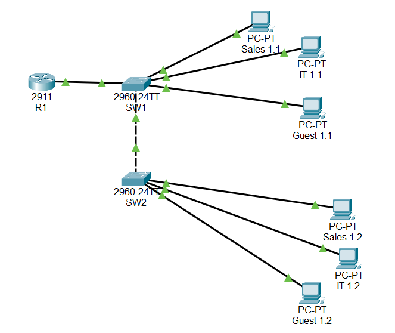

# Networking Labs

Hands-on Cisco networking labs built in Cisco Packet Tracer.

## About me
CCNA-certified, with a bachelor's degree in IT. Interested in networking and cybersecurity.

## Labs

### 01 - Small Office Network

- Subnetting: 192.168.10.0/24 split into three /26 subnets
- VLANs: Sales (10), IT (20), Guest (30)
- Trunk and access ports
- Inter-VLAN routing (Router-on-a-Stick)
- DHCP pools on the router
- Spanning Tree: SW1 configured as root bridge
- ACL: Guest VLAN blocked from reaching the IT VLAN

## Tools
Cisco Packet Tracer

